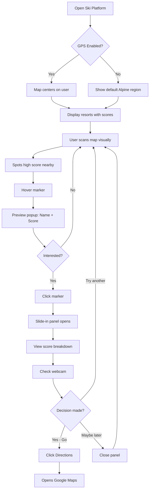
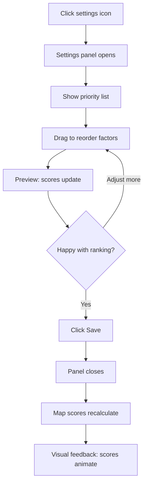

# UX Design Specification - Ski Platform

**Author:** Pouetpouets
**Date:** 2026-01-29

---

## Executive Summary

### Project Vision

Ski Platform is a decision-support tool that eliminates "where should I ski today?" paralysis. In a landscape where skiers waste hours navigating 20+ resort websites with inconsistent layouts, Ski Platform delivers instant clarity through a Google Maps-style radar and a single **Perfect Day Score** per resort.

The UX philosophy is radical simplicity: one map, one score, one decision. Users see nearby resorts ranked by their personal priorities, tap for details, verify with webcams, and go ski. The platform succeeds when users think "Damn, that was really an amazing day."

### Target Users

**Lucas - The Powder Hunter** (32, Lyon, 15-20 days/season)
- Priorities: Snow quality > Weather > Crowds
- Pain: Checks 5+ sites every ski morning, misses perfect powder at unknown resorts
- Success: "Fresh powder all morning at a resort I'd never tried"

**Sophie - The Budget Family Skier** (41, Grenoble, 8-10 days/season)
- Priorities: Price > Distance > Crowds
- Pain: 30+ minutes comparing prices, defaults to same familiar resort
- Success: "Great deal at a family-friendly resort I didn't know existed"

**Marc - The Crowd Avoider** (45, Annecy, 25+ days/season)
- Priorities: Low crowds > Snow quality > Weather
- Pain: Arrives to packed parking and long lift queues unexpectedly
- Success: "Empty slopes when I expected crowds"

### Key Design Challenges

1. **Score Trust** - Users must believe the Perfect Day Score without needing to understand the algorithm. Building confidence through transparency and accuracy is critical.

2. **Information Density** - Displaying many resorts with scores on a map without visual overload. The radar must feel clean, not cluttered.

3. **Priority Configuration UX** - Making factor weighting intuitive while clearly showing how changes affect recommendations.

4. **Decision Speed vs. Detail** - Users want instant decisions but also need verification (webcams, conditions). Balancing quick clarity with available depth.

### Design Opportunities

1. **One-Glance Decision** - A perfectly executed map + score system enables decisions in seconds, not minutes

2. **Discovery Delight** - Surfacing hidden gem resorts creates memorable "I never knew about this place" moments

3. **Confidence Through Transparency** - Score breakdowns on demand build trust without adding friction

4. **Emotional Payoff** - The post-ski "amazing day" feeling starts with trusting the recommendation enough to try somewhere new

## Core User Experience

### Defining Experience

Ski Platform's core experience is the **"One-Glance Decision"**: open the app, see the map with scores, pick a resort, go ski. The entire value proposition lives in this loop.

The primary user action is visual scanning: eyes land on the map, find high scores near their location, and within seconds they know where to go. Everything else (details, webcams, priority tuning) supports this core moment.

### Platform Strategy

| Aspect | Decision |
|--------|----------|
| Platform | Desktop web application |
| Browsers | Chrome, Edge (latest versions) |
| Input | Mouse/keyboard only (no touch optimization) |
| Connectivity | Online required |
| Data freshness | Batch updates (~6h intervals) |
| Webcams | Thumbnail preview if feasible, otherwise external link (new tab) |

### Effortless Interactions

| Interaction | Design Goal |
|-------------|-------------|
| First load | GPS permission → instant personalized map with scores |
| Scanning resorts | Visual hierarchy makes high scores pop immediately |
| Checking details | Click resort → slide-in panel with conditions, webcam, score breakdown |
| Adjusting priorities | Drag-and-drop reordering → scores recalculate on save |
| Verifying conditions | Webcam thumbnail visible, one click to live feed |

### Critical Success Moments

| Moment | User Realization |
|--------|------------------|
| First map view | "I can see everything at once" - instant clarity vs. 20 tabs |
| Discovery moment | "I never heard of this resort but it's ranked #2 for me" - trust builds |
| Score validation | "The breakdown makes sense" - transparency creates confidence |
| Post-ski return | "It was actually a great day" - trust confirmed, habit formed |

### Experience Principles

1. **Score First** - The Perfect Day Score is the hero; details are progressive disclosure
2. **Visual Scanning** - Users decide with their eyes before they click anything
3. **Trust Through Transparency** - Show the "why" behind every score on demand
4. **Discovery Over Familiarity** - Surface unknown gems, don't just confirm known resorts
5. **Respect Time** - Every interaction should feel faster than checking one resort website

## Desired Emotional Response

### Primary Emotional Goals

| User | Primary Emotion | Supporting Emotions |
|------|-----------------|---------------------|
| **All users** | Calm confidence | Clarity, trust, efficiency |

**Product Personality:** Utilitarian tool, not playful companion. Like a trusted weather app or Google Maps - reliable, clear, gets out of the way. The app helps users decide; it doesn't tell them what to do.

### Emotional Journey Mapping

| Stage | Target Emotion | Design Implication |
|-------|----------------|-------------------|
| First visit | "This is simple" | Clean interface, no onboarding walls |
| Map view | "I see everything I need" | Information hierarchy, scores prominent |
| Exploring a resort | "I understand why it's ranked this way" | Transparent score breakdown |
| Making decision | "I'm confident in this choice" | User feels in control, not pushed |
| Post-ski return | "It worked, I trust this" | Validation builds habit |

### Micro-Emotions

**To cultivate:**
- Confidence over confusion
- Clarity over overwhelm
- Trust over skepticism
- Efficiency over friction
- Control over being directed

**To actively avoid:**
- **Hype** - No "Best day ever!" marketing speak
- **Pressure** - No urgency tactics or FOMO
- **Overwhelm** - No data dumps or complex dashboards
- **Distrust** - No hidden logic or unexplained rankings

### Design Implications

| Emotion to Create | UX Approach |
|-------------------|-------------|
| Calm confidence | Muted color palette, clean typography, generous whitespace |
| Trust | Transparent score breakdowns, show data sources |
| Clarity | One score per resort, progressive disclosure for details |
| User control | Priorities are user-defined, recommendations feel like suggestions |
| Efficiency | Minimal clicks, fast load, no unnecessary steps |

### Emotional Design Principles

1. **Tool, not toy** - Professional utility aesthetic, no gamification or playfulness
2. **Suggest, don't push** - Present options with data; user makes the call
3. **Transparency builds trust** - Always show the "why" behind scores
4. **Calm over excitement** - Muted confidence, not hype energy
5. **Respect user intelligence** - No hand-holding, no dumbing down

## UX Pattern Analysis & Inspiration

### Inspiring Products Analysis

**Google Maps** - Primary Reference
- Map-centric interface with user location at center
- Layers system for showing different information types
- Clean visual hierarchy despite dense information
- Instant comprehension: one glance tells you where things are
- Progressive disclosure: overview first, details on interaction

**Spline** - Aesthetic Reference
- Modern, professional tool aesthetic
- Clean typography and generous spacing
- Muted, sophisticated color palette
- "Serious tool" energy without being cold
- Desktop-optimized interface design

### Anti-Patterns to Avoid

**Skiinfo & Traditional Ski Aggregators**

| Anti-Pattern | Problem | Our Alternative |
|--------------|---------|-----------------|
| Data dump | All info shown at once, user must process | Score-first, details on demand |
| User does the work | Compare, analyze, decide yourself | Direct recommendation |
| Navigation maze | Multiple clicks to find what you need | Everything on the map |
| No personalization | Same view for everyone | Priority-weighted scores |
| Overwhelming tables | Dense data grids | Visual, scannable interface |

**The core difference:** Skiinfo says "Here's everything, good luck." Ski Platform says "Here's your best option, here's why."

### Transferable UX Patterns

| Pattern | Source | Ski Platform Application |
|---------|--------|--------------------------|
| Map as primary UI | Google Maps | Resorts positioned around user location |
| Score overlays | Maps ratings | Perfect Day Score badges on markers |
| Slide-in panels | Google Maps | Resort details appear without leaving map |
| Layer toggles | Google Maps | Show/hide weather, crowd predictions, etc. |
| Clean tool aesthetic | Spline | Professional, muted, confident visual design |
| Progressive disclosure | Both | Score → Details → Webcam → Full breakdown |

### Design Inspiration Strategy

**Adopt directly:**
- Google Maps marker/popup interaction model
- Layer-based information architecture
- User-centered map positioning
- Spline's typography and spacing philosophy

**Adapt for Ski Platform:**
- Markers show score prominently (not just location pins)
- Slide-in panel optimized for ski decision data
- Color coding tied to score quality, not category
- Simpler than Maps (fewer features, more focused)

**Explicitly avoid:**
- Skiinfo's "browse and compare" model
- Dense data tables requiring mental processing
- Multiple pages to reach a decision
- Any "figure it out yourself" patterns

## Design System Foundation

### Design System Choice

**Tailwind CSS + shadcn/ui**

A utility-first CSS framework combined with a collection of accessible, customizable components built on Radix UI primitives.

### Rationale for Selection

| Factor | Assessment |
|--------|------------|
| Customization | Excellent - can achieve Spline-like aesthetic easily |
| Bundle size | Lightweight - important for map-heavy application |
| Accessibility | Built-in via Radix primitives |
| Documentation | Excellent, large community |
| DX (Developer Experience) | Modern, fast iteration |
| Flexibility | High - not locked into a visual language |

### Implementation Approach

1. **Tailwind Configuration** - Custom theme with muted color palette, generous spacing
2. **shadcn/ui Components** - Install only needed components (Button, Card, Dialog, Popover, etc.)
3. **Custom Components** - Build map-specific components (ScoreMarker, ResortPanel, PriorityConfig)
4. **Design Tokens** - Define in Tailwind config for consistency

### Customization Strategy

**Color System:**
- Muted, professional palette aligned with Spline aesthetic
- Score-based color coding (green → amber → red for quality indication)
- Map-friendly colors that don't compete with terrain

**Typography:**
- System font stack for performance
- Clear hierarchy: scores prominent, details secondary

**Spacing:**
- Generous whitespace (Spline-inspired)
- Comfortable click targets for map interactions

**Components to customize:**
- Card → ResortCard with score badge
- Popover → Map marker popups
- Sheet/Drawer → Slide-in resort detail panel
- Slider/Sortable → Priority configuration

## Defining Experience

### Core Interaction

**The defining experience of Ski Platform:**
> "See your best ski options scored on a map, pick one, go."

This is the interaction users will describe to friends. If we nail this, everything else follows.

### User Mental Model

**Current approach (without Ski Platform):**
1. Open Skiinfo, Météo France, resort websites (5-20 tabs)
2. Manually check snow conditions, weather, prices
3. Try to remember and compare mentally
4. Give up and go to the usual resort
5. Wonder if somewhere else was better

**New mental model (with Ski Platform):**
1. Open Ski Platform
2. See map with scores already calculated for me
3. Highest score = best option for my priorities
4. Click to verify (webcam, details)
5. Go ski with confidence

**The shift:** From "research and compare" to "see and decide."

### Success Criteria

| Criterion | Target |
|-----------|--------|
| Time to decision | Under 60 seconds from opening app |
| Clicks to decide | 2-3 clicks maximum |
| Cognitive load | Zero mental math required |
| Confidence | User trusts the score enough to try new resorts |
| Return usage | Users come back every ski day |

### Pattern Analysis

| Element | Type | Rationale |
|---------|------|-----------|
| Map interface | Established | Users know Google Maps |
| Score on markers | Established | Like Google ratings, Uber surge indicators |
| Slide-in details | Established | Google Maps pattern |
| Personalized ranking | Novel twist | Scores adapt to YOUR priorities |
| Direct recommendation | Novel twist | "Best for you" vs "here's all the data" |

**No user education needed** - familiar patterns with a personalized twist.

### Experience Mechanics

**1. Initiation**
- User opens app → GPS locates them → Map centers on user
- Resorts appear as markers with scores visible immediately
- Highest scores visually prominent (size, color, position)

**2. Interaction**
- Scan map visually → spot high scores
- Hover marker → quick preview (name, score, top condition)
- Click marker → slide-in panel with full details

**3. Feedback**
- Score breakdown shows "why" (Snow: 9/10, Crowds: 8/10, etc.)
- Webcam thumbnail confirms conditions visually
- User feels informed, not guessing

**4. Completion**
- User has enough info to decide
- Closes panel, opens Google Maps for directions, or
- Bookmarks resort for later comparison
- Returns next ski day with trust established

## Visual Design Foundation

### Color System

**Philosophy:** Muted, professional, calm. Colors support the map and scores without competing for attention.

**Core Palette:**

| Role | Color | Hex | Usage |
|------|-------|-----|-------|
| Background | Slate 50 | `#F8FAFC` | Page background, lets map breathe |
| Surface | White | `#FFFFFF` | Cards, panels, slide-in sheets |
| Primary | Slate 600 | `#475569` | Primary text, icons |
| Accent | Blue 500 | `#3B82F6` | Interactive elements, links, CTAs |
| Text Primary | Slate 800 | `#1E293B` | Headings, important text |
| Text Secondary | Slate 500 | `#64748B` | Labels, metadata |
| Border | Slate 200 | `#E2E8F0` | Subtle borders, dividers |

**Score Colors (Quality Indication):**

| Score Range | Color | Hex | Visual |
|-------------|-------|-----|--------|
| 80-100% | Green | `#22C55E` | Excellent conditions |
| 60-79% | Amber | `#F59E0B` | Good conditions |
| 40-59% | Orange | `#F97316` | Fair conditions |
| 0-39% | Red | `#EF4444` | Poor conditions |

### Typography System

**Font Stack:**
```css
font-family: system-ui, -apple-system, BlinkMacSystemFont, 'Segoe UI', Roboto, sans-serif;
```

**Type Scale:**

| Level | Size | Weight | Usage |
|-------|------|--------|-------|
| Score Display | 24px | 700 | Perfect Day Score on markers |
| H1 | 24px | 600 | Panel titles |
| H2 | 18px | 600 | Section headers |
| Body | 14px | 400 | General content |
| Caption | 12px | 400 | Metadata, labels |

### Spacing & Layout Foundation

**Base Unit:** 4px

**Spacing Scale:**

| Token | Value | Usage |
|-------|-------|-------|
| xs | 4px | Tight gaps |
| sm | 8px | Inline spacing |
| md | 16px | Component padding |
| lg | 24px | Section spacing |
| xl | 32px | Major separations |

**Layout Principles:**
- Map takes full viewport minus slide-in panel
- Slide-in panel: 400px fixed width
- Generous padding inside panels (24px)
- Markers don't overlap (clustering at zoom levels)

### Accessibility Considerations

| Requirement | Implementation |
|-------------|----------------|
| Color contrast | All text meets WCAG AA (4.5:1 minimum) |
| Color independence | Scores use color + number (never color alone) |
| Focus states | Visible focus rings on all interactive elements |
| Font size | Minimum 14px for body text |

## Design Direction Decision

### Design Direction Explored

**"Map-First Minimal"** - A single cohesive direction emerged from our collaborative discovery, aligned with Google Maps interaction patterns and Spline aesthetic inspiration.

### Chosen Direction

| Element | Decision |
|---------|----------|
| **Layout** | Full-screen map (~70%) + slide-in panel (400px right) |
| **Navigation** | Minimal - everything accessible from the map |
| **Header** | Compact: logo, search bar, settings/profile |
| **Markers** | Circular badges with score prominently displayed |
| **Panels** | Slide-in from right, doesn't cover map entirely |
| **Density** | Airy - generous whitespace in all panels |
| **Aesthetic** | Spline-inspired: muted, professional, calm |

### Design Rationale

1. **Map dominance** - The map IS the product; it should dominate the viewport
2. **No navigation complexity** - Users don't need menus; they need the map and scores
3. **Slide-in over modal** - Keep map context visible while viewing details
4. **Score prominence** - The Perfect Day Score is the hero element on every marker
5. **Minimal chrome** - Header only for search and settings; no sidebar clutter

### Implementation Approach

**Screen Layout:**
```
┌─────────────────────────────────────────────────────────────────────────┐
│  [Logo]              [🔍 Search resorts...]              [⚙️] [👤]      │
├─────────────────────────────────────────────────────────┬───────────────┤
│                                                         │               │
│                                                         │  Resort Name  │
│                    M A P                                │  Score: 87%   │
│                                                         │               │
│            [72%]    [85%]           [91%]               │  ❄️ Snow: 9/10│
│                           📍                            │  👥 Crowds: 8 │
│      [64%]                    [78%]                     │  ☀️ Weather: 7│
│                                                         │               │
│                  [88%]        [69%]                     │  [📷 Webcam]  │
│                                                         │               │
│                                                         │  [Directions] │
└─────────────────────────────────────────────────────────┴───────────────┘
```

**Key Components:**
- `ScoreMarker` - Circular badge on map with score
- `ResortPanel` - Slide-in detail panel
- `SearchBar` - Global search in header
- `PriorityConfig` - Settings panel for priority ordering

## User Journey Flows

### Core Decision Flow

The primary user loop that defines the product experience.

**Trigger:** User wants to decide where to ski today



**Success Metric:** User decides in under 60 seconds

### Search Flow

Quick access to a specific resort by name.

**Trigger:** User knows a resort name or wants to check a specific location

```mermaid
flowchart TD
    A[Any screen] --> B[Click search bar / Ctrl+K]
    B --> C[Search modal opens]
    C --> D[Type resort name]
    D --> E[Results filter as-you-type]
    E --> F{Found?}
    F -->|Yes| G[Click result]
    F -->|No results| H[Show "No results"]
    G --> I[Map zooms to resort]
    I --> J[Panel opens automatically]
    H --> K[Suggest browse by region]
```

**Success Metric:** Resort found in under 3 keystrokes

### Priority Configuration Flow

User customizes how the Perfect Day Score is calculated.

**Trigger:** User wants to adjust their priorities (snow vs crowds vs price)



**Success Metric:** Priorities set in under 30 seconds

### First-Time User Flow

Onboarding experience for new users.

**Trigger:** First visit to Ski Platform

```mermaid
flowchart TD
    A[Land on Ski Platform] --> B[Minimal splash: logo + tagline]
    B --> C{Browser GPS prompt}
    C -->|Allow| D[Map centers on user]
    C -->|Deny| E[Show region selector]
    D --> F[Display map with scores]
    E --> G[User picks region]
    G --> F
    F --> H[Subtle tooltip: "Click a resort to see details"]
    H --> I[User explores naturally]
```

**Design Principle:** No onboarding walls - learn by doing

### Journey Patterns

| Pattern | Application |
|---------|-------------|
| **Progressive Disclosure** | Score → Details → Webcam → Full breakdown |
| **Hover Preview** | Quick info without commitment (click) |
| **Contextual Actions** | Actions appear where relevant (in panel, not global nav) |
| **Instant Feedback** | Scores update visually when priorities change |
| **Escape Hatch** | Close panel anytime, return to map |

### Flow Optimization Principles

1. **Minimize clicks to value** - 2-3 clicks from open to decision
2. **No dead ends** - Every screen has a clear next action
3. **Preserve context** - Slide-in panels don't hide the map
4. **Keyboard accessible** - Ctrl+K for search, Esc to close
5. **Error recovery** - GPS denied? No problem, pick a region

## Component Strategy

### Design System Components

**From shadcn/ui (Use Directly):**

| Component | Usage in Ski Platform |
|-----------|----------------------|
| `Button` | CTAs, action buttons, directions link |
| `Card` | Content containers in panels |
| `Sheet` | Slide-in panel wrapper (right side) |
| `Popover` | Hover previews on map markers |
| `Dialog` | Settings modal, confirmations |
| `Badge` | Score badges, status indicators |
| `Tooltip` | Help hints, keyboard shortcuts |
| `Command` | Search modal (Ctrl+K pattern) |
| `Separator` | Visual dividers in panels |
| `ScrollArea` | Scrollable content in fixed panels |

### Custom Components

**ScoreMarker**
- **Purpose:** Display resort on map with visible score
- **Anatomy:** Circular badge with score percentage, color-coded
- **States:** Default, hover (enlarged), selected (highlighted border)
- **Variants:** Size varies by zoom level (clustering at low zoom)

**ResortPanel**
- **Purpose:** Full resort details in slide-in panel
- **Anatomy:** Header (name, score), score breakdown, webcam, actions
- **States:** Open, closed, loading
- **Behavior:** Slides in from right, 400px width, dismissible

**ScoreBreakdown**
- **Purpose:** Show factor-by-factor score explanation
- **Anatomy:** List of factors with individual scores and weights
- **Content:** Snow (9/10), Crowds (8/10), Weather (7/10), etc.
- **Behavior:** Shows user's priority order, explains "why this score"

**PriorityConfig**
- **Purpose:** Let users reorder their scoring priorities
- **Anatomy:** Draggable list of factors
- **States:** Default, dragging, saving
- **Behavior:** Drag-and-drop reordering, preview score changes

**WebcamPreview**
- **Purpose:** Visual verification of conditions
- **Anatomy:** Thumbnail image + "View live" link
- **States:** Loading, loaded, error (fallback to link only)
- **Behavior:** Click opens external webcam in new tab

**MapContainer**
- **Purpose:** Wrapper for map library (Leaflet or Mapbox)
- **Anatomy:** Full-bleed map with custom controls
- **Behavior:** GPS centering, zoom controls, marker clustering

### Component Implementation Strategy

**Build Order (by dependency):**

1. **Phase 1 - Core Infrastructure**
   - `MapContainer` - Foundation for everything
   - `ScoreMarker` - The hero component

2. **Phase 2 - Information Display**
   - `ResortPanel` - Primary information display
   - `ScoreBreakdown` - Trust-building transparency

3. **Phase 3 - User Configuration**
   - `PriorityConfig` - Personalization
   - `WebcamPreview` - Verification

**Design Token Usage:**
- All custom components use Tailwind config tokens
- Colors from established palette (score colors, surfaces)
- Spacing from 4px base unit scale
- Typography from defined type scale

## UX Consistency Patterns

### Loading States

| Element | Loading Pattern |
|---------|----------------|
| **Map** | Skeleton map background + centered spinner |
| **Markers** | Progressive fade-in as data loads |
| **Panel content** | Skeleton placeholders matching content layout |
| **Webcam** | Placeholder image → loaded image (or error fallback) |
| **Search results** | Skeleton list items during search |

**Principle:** Never show empty containers; always indicate something is happening.

### Hover & Click Interactions

| Element | Hover | Click |
|---------|-------|-------|
| **Score Marker** | Enlarge + show popover preview | Open slide-in panel |
| **Panel close button** | Subtle highlight | Close panel |
| **Webcam thumbnail** | Slight scale up | Open external link (new tab) |
| **Priority item** | Drag handle appears | Begin drag |
| **Search result** | Background highlight | Select + zoom to resort |

**Principle:** Hover reveals; click commits.

### Panel Behavior

| Behavior | Pattern |
|----------|---------|
| **Direction** | Always slide-in from right |
| **Width** | Fixed 400px |
| **Dismissal** | Esc key, click outside, or close button |
| **Stacking** | One panel at a time (new panel replaces current) |
| **Animation** | 200ms ease-out slide |
| **Focus** | Focus trapped inside when open |

### Feedback Patterns

| Type | Pattern | Duration |
|------|---------|----------|
| **Success** | Toast notification (bottom-right) | 3 seconds auto-dismiss |
| **Error** | Inline message near source | Persistent until resolved |
| **Warning** | Inline message with action | Persistent with dismiss option |
| **Info** | Subtle tooltip or inline hint | Contextual |

**Examples:**
- "Priorities saved" → Success toast
- "GPS access denied" → Inline error with "Select region manually" action
- "Data last updated 2h ago" → Info badge on map

### Empty States

| Scenario | Pattern |
|----------|---------|
| **No search results** | "No resorts found" + suggest browse by region |
| **GPS denied, no region** | Region selector with Alpine overview |
| **Webcam unavailable** | "Webcam unavailable" + direct link to resort site |

**Principle:** Always provide a next action; never dead-end the user.

### Keyboard Navigation

| Shortcut | Action |
|----------|--------|
| `Ctrl+K` / `Cmd+K` | Open search |
| `Esc` | Close current panel/modal |
| `Tab` | Navigate focusable elements |
| `Enter` | Confirm selection |
| `Arrow keys` | Navigate search results |

### Animation Principles

| Context | Animation |
|---------|-----------|
| **Panel slide** | 200ms ease-out |
| **Marker hover** | 150ms scale |
| **Toast appear** | 200ms fade-in + slide-up |
| **Score update** | 300ms number transition |

**Principle:** Fast, subtle, purposeful. Animations support comprehension, never delay action.

## Responsive Design & Accessibility

### Responsive Strategy

**Target Platform:** Desktop-only for MVP

| Breakpoint | Width | Layout Adaptation |
|------------|-------|-------------------|
| **Large Desktop** | 1280px+ | Full layout: map + 400px panel |
| **Desktop** | 1024-1279px | Compact: map + 350px panel |
| **Below 1024px** | < 1024px | Not supported (show "Desktop required" message) |

**Rationale:** Focus development effort on the primary use case (desktop decision-making) before expanding to mobile.

### Future Mobile Consideration

When mobile is added post-MVP:
- Bottom sheet instead of side panel
- Larger touch targets (48px minimum)
- Simplified map controls
- Swipe gestures for panel dismiss

### Accessibility Strategy

**WCAG Compliance Level:** AA

| Requirement | Implementation |
|-------------|----------------|
| **Color Contrast** | 4.5:1 minimum for all text |
| **Color Independence** | Scores always show number + color |
| **Keyboard Navigation** | Full support for all interactions |
| **Focus Indicators** | Visible focus rings (2px blue outline) |
| **Screen Readers** | ARIA labels on all interactive elements |
| **Skip Links** | Skip to map, skip to panel |

### Keyboard Accessibility

| Key | Action | Context |
|-----|--------|---------|
| `Tab` | Move focus forward | Global |
| `Shift+Tab` | Move focus backward | Global |
| `Enter` | Activate focused element | Global |
| `Esc` | Close panel/modal | When panel open |
| `Ctrl/Cmd+K` | Open search | Global |
| `Arrow keys` | Navigate results | In search modal |

### ARIA Implementation

| Component | ARIA Attributes |
|-----------|-----------------|
| **ScoreMarker** | `role="button"`, `aria-label="[Resort name], score [X]%"` |
| **ResortPanel** | `role="complementary"`, `aria-label="Resort details"` |
| **Search** | `role="search"`, `aria-expanded`, `aria-activedescendant` |
| **Score breakdown** | `role="list"`, items with `role="listitem"` |

### Testing Checklist

**Before Launch:**
- [ ] Keyboard-only navigation test (complete all flows)
- [ ] Screen reader test (VoiceOver on Mac)
- [ ] Color contrast verification (all text passes 4.5:1)
- [ ] Focus order logical and visible
- [ ] No content conveyed by color alone
